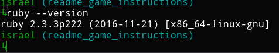
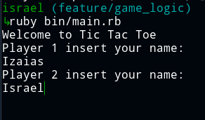
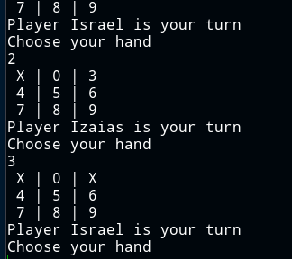
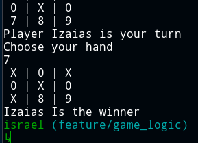

# Tic-Tac-Toe
Build a tic-tac-toe game on the command line where two human players can play against each other and the board is displayed in between turns.

# Instructions

 1. The game is played on a grid that's 3 squares by 3 squares.

 2. You are X, your friend is O. Players take turns putting their marks in empty squares.
          
 3. The first player to get 3 of his or her marks in a row (up, down, across or diagonally) is the winner.
          
 4. When all 9 squares are full, the game is over. If no player has 3 marks in a row, the game ends in a tie. 

# How to run the game

 * Be sure that you have `ruby`installed, you can check using `ruby --version`:



 * Clone the repository 
```
git clone https://github.com/Israel-Laguan/Tic-Tac-Toe.git
cd Tic-Tac-Toe
```
 * Execute the main file with your terminal
  `ruby bin/main.rb`
 * Get a friend (or victim, if you are good) to play 
 * Have fun!

# Playing the game

* Starting the game


* Set your names



* You will see the board, its made with numbers portraying the available spaces.
You can choose one of the numbers where your mark will be placed




* When someone get 3 in a row you win and the game ends



* You can enjoy any number of times

# Built With
* Ruby v2.6.3+
* `rvm`
* VsCode
* Windows + WSL && Debian
* Love and passion for code ❤️

# Features

* Gem Folder structure (`/bin` & `lib` folders)
* Modules, classes and methods
* Use `requiere_relative` for call code from another file
* `p`, `puts` and `get chomps` for user output and interaction
* *Rubocop* for code linting

# Authors
🇧🇷 [Izaias Neto](https://www.github.com/izaiasneto4)
🇨🇴🇸🇻 [Israel Laguan](https://www.github.com/Israel-Laguan)

# License

This project is licensed under the MIT License - see the [LICENSE.md](LICENSE.md) file for details 
