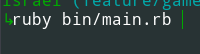
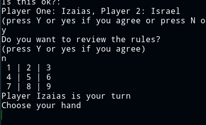
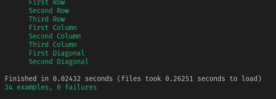

<!-- PROJECT SHIELDS -->
[![Forks][forks-shield]][forks-url]
[![Stargazers][stars-shield]][stars-url]
[![Issues-open][issues-open-shield]][issues-url]
[![Issues-closed][issues-closed-shield]][issues-url]
[![Contributors][contributors-shield]][contributors-url]
[![Framework][badge-framework]][framework-url]
[![contributions welcome][contributions-welcome]][issues-url]

<!-- PROJECT LOGO -->
<br />
<p align="center">
  <a href="https://">
	  
  </a>

  <h1 align="center">
	Tic-Tac-Toe
  </h1>

  <p align="center">
    <br />
	  🖊️
    <a href="https://">Read the article</a>
    🐞
    <a href="https://github.com/Israel-Laguan/Tic-Tac-Toe/issues">Report a Bug</a>
    🙋‍♂️
    <a href="https://github.com/Israel-Laguan/Tic-Tac-Toe/issues">Request Feature</a>
  </p>
</p>

## Table of Contents

1. [Tic-Tac-Toe](#tic-tac-toe)
2. [Instructions](#instructions)
3. [How to run the game](#how-to-run-the-game)
4. [Playing the game](#playing-the-game)
5. [Author](#author)
6. [Contributing](#contributing)
7. [Show your support](#show-your-support)
8. [License](#license)

# Tic-Tac-Toe
Build a tic-tac-toe game on the command line where two human players can play against each other and the board is displayed in between turns.

# Instructions

 1. The game is played on a grid that's 3 squares by 3 squares.

 2. You are X, your friend is O. Players take turns putting their marks in empty squares.
          
 3. The first player to get 3 of his or her marks in a row (up, down, across or diagonally) is the winner.
          
 4. When all 9 squares are full, the game is over. If no player has 3 marks in a row, the game ends in a tie. 

# How to run the game

 * Be sure that you have `ruby`installed, you can check using `ruby --version`:


 * Clone the repository 
```
git clone https://github.com/Israel-Laguan/Tic-Tac-Toe.git
cd Tic-Tac-Toe
```
 * Execute the main file with your terminal
  `ruby bin/main.rb`
 * Get a friend (or victim, if you are good) to play 
 * Have fun!

# Playing the game

* Starting the game



* Set your names


* You will see the board, its made with numbers portraying the available spaces.
You can choose one of the numbers where your mark will be placed




* When someone get 3 in a row you win and the game ends


* You can enjoy any number of times

# Built With
* Ruby v2.6.3+
* `rvm`
* VsCode
* Windows + WSL && Debian
* Love and passion for code ❤️

# Features

* Gem Folder structure (`/bin` & `lib` folders)
* Modules, classes and methods
* Use `requiere_relative` for call code from another file
* `p`, `puts` and `get chomps` for user output and interaction
* *Rubocop* for code linting
* Tests using `RSpec`



# Authors
* 🇧🇷 [Izaias Neto](https://www.github.com/izaiasneto4)
* 🇨🇴🇸🇻 [Israel Laguan](https://www.github.com/Israel-Laguan)

# Author Israel Laguan

<table style="width:100%">
  <tr>
    <td>
        <div align="center">
            <a href="./docs/img/photo.png" target="_blank" rel="author">
                
            </a>
            <h2>
                <a href="https://israel-laguan.github.io/" target="_blank" rel="author">
                    Israel Laguan
                </a>
            </h2>
        </div>
    </td>
    <td>
        <div align="center">
            <a href="mailto:israellaguan@gmail.com" target="_blank" rel="author">
                
                <h3>
                    Email me to 
                    <a href="mailto:israellaguan@gmail.com">
                        israellaguan@gmail.com
                    </a>
                </h3>
            </a>
            <a href="https://www.linkedin.com/in/israellaguan/" target="_blank" rel="author">
                
                <h3>
                    Connect to my Linkedin
                </h3>
            </a>
            <a href="https://github.com/Israel-Laguan" target="_blank" rel="author">
                
                <h3>
                    Check my GitHub Profile
                </h3>
            </a>
        </div>
    </td>
  </tr>
</table> 

# Contributing

[![contributions welcome][contributions-welcome]][issues-url]

🤝 Contributions, issues and feature requests are welcome!
Feel free to check the [issues page][issues-url].

# Show your support

🤗 Give a ⭐️ if you like this project!

Icons from:

<a href="https://icons8.com/icon/13917/full-image">Icons8</a>

# License

[![License][badge-license]](http://badges.mit-license.org)

📝 This project is licensed under the [MIT](LICENSE)\
Feel free to fork this project and improve it - see the [LICENSE.md](LICENSE.md) file for details 

<!-- MARKDOWN LINKS & IMAGES -->
[contributors-shield]: https://img.shields.io/github/contributors/Israel-Laguan/Tic-Tac-Toe?style=for-the-badge
[contributors-url]: https://github.com/Israel-Laguan/Tic-Tac-Toe/graphs/contributors
[forks-shield]: https://img.shields.io/github/forks/Israel-Laguan/Tic-Tac-Toe?style=for-the-badge
[forks-url]: https://github.com/Israel-Laguan/Tic-Tac-Toe/network/members
[stars-shield]: https://img.shields.io/github/stars/Israel-Laguan/Tic-Tac-Toe?style=for-the-badge
[stars-url]: https://github.com/Israel-Laguan/Tic-Tac-Toe/stargazers
[issues-open-shield]: https://img.shields.io/github/issues/Israel-Laguan/Tic-Tac-Toe?style=for-the-badge
[issues-url]: https://github.com/Israel-Laguan/Tic-Tac-Toe/issues
[issues-closed-shield]: https://img.shields.io/github/issues-closed/Israel-Laguan/Tic-Tac-Toe?style=for-the-badge
[badge-framework]: https://img.shields.io/badge/framework-here-9cf?style=for-the-badge
[framework-url]: https://google.com
[contributions-welcome]: https://img.shields.io/badge/contributions-welcome-brightgreen.svg?style=for-the-badge
[badge-license]: https://img.shields.io/:license-mit-blue.svg?style=for-the-badge
